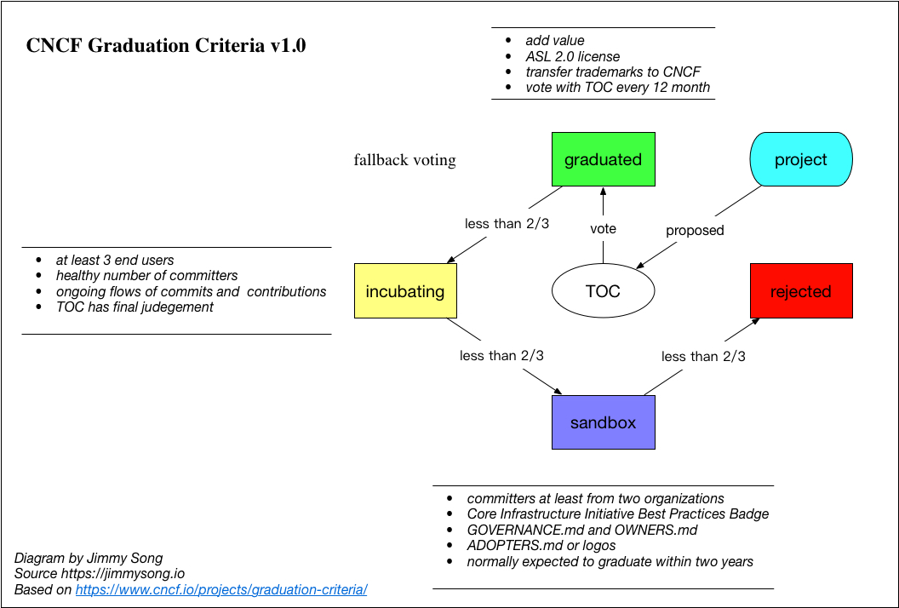

# CNCF - 云原生计算基金会简介

CNCF，全称Cloud Native Computing Foundation（云原生计算基金会），口号是**坚持和整合开源技术来让编排容器作为微服务架构的一部分**，其作为致力于云原生应用推广和普及的一支重要力量，不论您是云原生应用的开发者、管理者还是研究人员都有必要了解。

CNCF作为一个厂商中立的基金会，致力于Github上的快速成长的开源技术的推广，如Kubernetes、Prometheus、Envoy等，帮助开发人员更快更好的构建出色的产品。

下图是CNCF的全景图。

该全景图不断更新中，原图请见：https://github.com/cncf/landscape

其中包含了CNCF中托管的项目，还有很多是非CNCF项目。

关于CNCF的使命与组织方式请参考[CNCF章程](https://www.cncf.io/about/charter/)，概括的讲CNCF的使命包括以下三点：

* 容器化包装。
* 通过中心编排系统的动态资源管理。
* 面向微服务。

CNCF这个角色的作用是推广技术，形成社区，开源项目管理与推进生态系统健康发展。

另外CNCF组织由以下部分组成：

* **会员**：白金、金牌、银牌、最终用户、学术和非赢利成员，不同级别的会员在治理委员会中的投票权不同。
* **理事会**：负责事务管理
* **TOC（技术监督委员会）**：技术管理
* **最终用户社区**：推动CNCF技术的采纳并选举最终用户技术咨询委员会
* **最终用户技术咨询委员会**：为最终用户会议或向理事会提供咨询
* **营销委员会**：市场推广

## CNCF项目成熟度分级与毕业条件

每个CNCF项目都需要有个成熟度等级，申请成为CNCF项目的时候需要确定项目的成熟度级别。

成熟度级别（Maturity Level）包括以下三种：

* sandbox（初级）
* incubating（孵化中）
* graduated（毕业）

是否可以成为CNCF项目需要通过Technical Oversight Committee \(技术监督委员会）简称[TOC](https://github.com/cncf/toc)，投票采取fallback策略，即**回退策略**，先从最高级别（graduated）开始，如果2/3多数投票通过的话则确认为该级别，如果没通过的话，则进行下一低级别的投票，如果一直到inception级别都没得到2/3多数投票通过的话，则拒绝其进入CNCF项目。

当前所有的CNCF项目可以访问[https://www.cncf.io/projects/](https://www.cncf.io/projects/) 。

项目所达到相应成熟度需要满足的条件和投票机制见下图：

## TOC（技术监督委员会）

TOC（Technical Oversight Committee）作为CNCF中的一个重要组织，它的作用是：

* 定义和维护技术视野
* 审批新项目加入组织，为项目设定概念架构
* 接受最终用户的反馈并映射到项目中
* 调整组件见的访问接口，协调组件之间兼容性

TOC成员通过选举产生，见[选举时间表](https://github.com/cncf/toc/blob/master/process/election-schedule.md)。

参考CNCF TOC：[https://github.com/cncf/toc](https://github.com/cncf/toc)

## 参考

* [https://www.cncf.io](https://www.cncf.io)
* [https://www.cncf.io/about/charter/](https://www.cncf.io/about/charter/)
* [https://github.com/cncf/landscape](https://github.com/cncf/landscape)
* [https://github.com/cncf/toc](https://github.com/cncf/toc)
